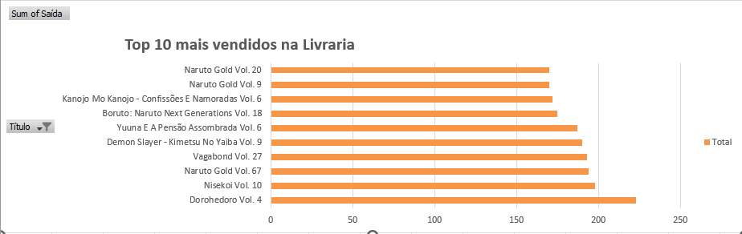
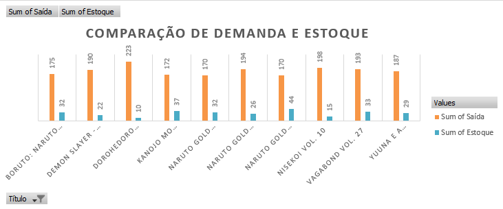
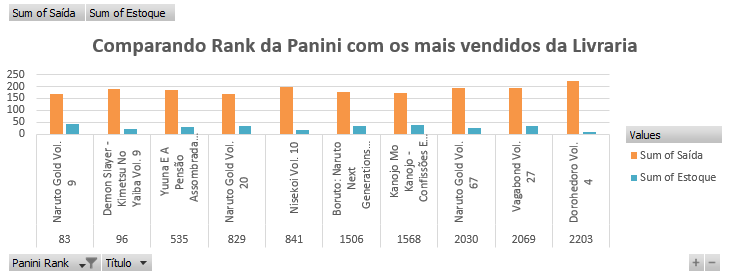
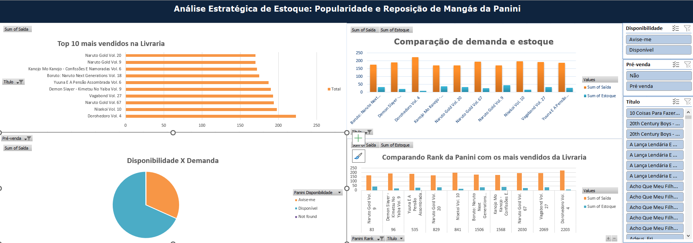

#   Projeto Comic Trend Scout

## Sobre o Projeto
Este projeto tem como objetivo otimizar a gestão de estoque da livraria, focado na análise de vendas e popularidade de mangás da editora Panini. A análise combina dados internos da livraria com métricas externas para identificar padrões de demanda, sugerir reposições estratégicas e evitar perdas de venda devido à falta de estoque.

##  Funcionalidades
- Coleta de Dados: Extração de informações de vendas e estoque da livraria.

- Web Scraping: Coleta de métricas externas da Panini, incluindo ranking de popularidade e disponibilidade.

- Análise de Tendências: Identificação de padrões de vendas e oportunidades de reposição.

- Dashboard Interativo: Visualização de insights através de gráficos dinâmicos.

##  Dados Utilizados

-   **Dados Internos:**

- Histórico de compras e vendas de títulos da Panini na livraria.

- Estoque atual de cada mangá disponível.

- Disponibilidade e precificação dos produtos.

-   **Dados Externos:**

    -   Ranking de popularidade da editora Panini.

    -   Disponibilidade dos títulos na editora.

##  Tecnologias Utilizadas

-   **Linguagens:** Python, SQL

-   **Bibliotecas e Frameworks:** Pandas, NumPy, Selenium, BeautifulSoup, Matplotlib, Seaborn

-   **Banco de Dados:** PostgreSQL

-   **Data Visualization Tool:** Excel, Jupyter Notebook

##  Estrutura do Projeto

    📂 ComicTrend Scout
        │── 📁 data               # Arquivos CSV e Excel com dados processados
        │── 📁 scripts            # Código-fonte para coleta e análise de dados
        │── 📁 notebooks          # Jupyter Notebooks com análises exploratórias
        │── 📁 models             # Modelos preditivos treinados
        │── 📁 dashboard          # Interface para visualização de insights
        │── README.md             # Documentação do projeto

#   Análises Realizadas

##  1. Top 10 Mangás Mais Vendidos na Livraria

-   Destaque para os títulos mais vendidos, auxiliando na definição de reposições estratégicas.

    

##  2. Comparação de Demanda vs. Estoque

-   Verificação do equilíbrio entre estoque disponível e a quantidade vendida de cada título.

       

##  3. Disponibilidade vs. Demanda

-   Análise da disponibilidade dos mangás na Panini versus sua demanda na livraria.

  

##  4. Comparação do Ranking com as Vendas da Livraria

-   Análise da relação entre os mangás mais populares da Panini e os mais vendidos na livraria.

     

## Status do Projeto

- ✅ Coleta e limpeza de dados internos
- ✅ Web scraping dos dados da Panini
- ✅ Desenvolvimento dos gráficos e análises
- 🔄 Refinamento dos insights e otimização do dashboard

## Próximos Passos

- Refinamento da análise para prever reposições futuras.
 
- Integração dos dados em um banco de dados centralizado.

- Testes para validação da estratégia de reposição.

##  Contribuições

Este projeto ainda está em desenvolvimento e colaborações são bem-vindas! Caso tenha sugestões ou queira contribuir, sinta-se à vontade para abrir uma issue ou pull request.

## 📧 Contato

Caso tenha dúvidas ou sugestões, entre em contato:
  LinkedIn: https://www.linkedin.com/in/celinemlyra/  
  GitHub: https://github.com/celymoon

. 
. 
.

_OBS: Este README será atualizado conforme o projeto avança._

